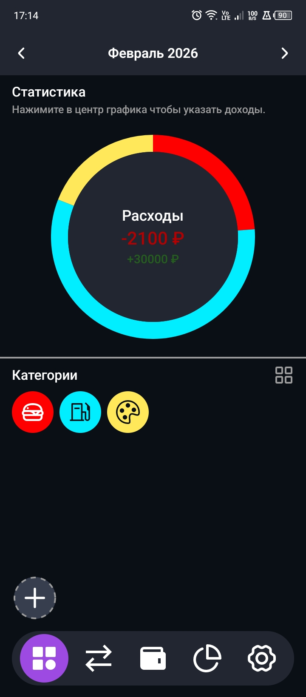
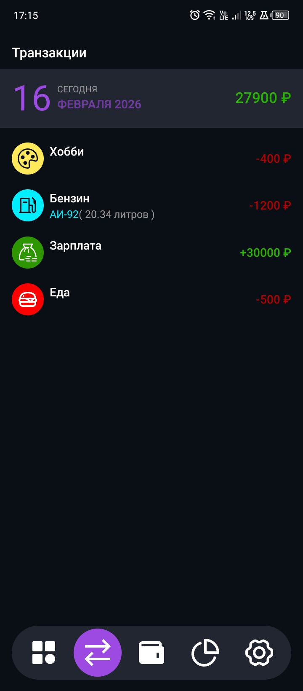

# Finexio 📊

**Finexio** — мобильное приложение для удобного учета личных финансов. Приложение помогает отслеживать доходы и расходы, а также анализировать свои траты с помощью наглядной статистики.

---

## Основные возможности

- 💰 **Учет доходов и расходов** — легко добавляйте, изменяйте и удаляйте транзакции.
- 🗂️ **Категории** — создавайте, редактируйте и удаляйте категории для лучшей организации расходов.
- 📈 **Статистика** — один наглядный график, который показывает распределение расходов по категориям.
- ⚡ **Простота и удобство** — минималистичный интерфейс для быстрого и комфортного управления финансами.

---

## Скриншоты

  
  

---

## Установка

Скачайте и установите APK на своё устройство Android:

[Скачать Finexio.apk](https://github.com/bakko7821/finexio-mobile-app/releases/tag/v2.0.0)

---

## Планы на будущее

- Добавление нескольких графиков и расширенной аналитики
- Возможность экспорта данных
- Улучшение интерфейса и пользовательского опыта

---

**Finexio** — ваш первый шаг к контролю над личными финансами. Простое, удобное и эффективное решение для ежедневного учета доходов и расходов.
